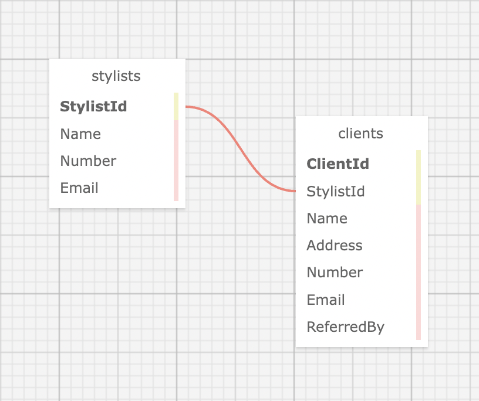

# Independent Project #9: Eau Claire's Salon


#### Contributors: _**Claire Thorington**_

## Technologies Used

* Markdown
* HTML
* CSS
* C#
* .NET
* ASP.NET Core MVC
* Razor
* MySQL
* MySQL Workbench
* EF Core

## Description

The home page welcomes Claire (no relation) to her salon management portal. Claire can see a list of stylists working at the salon, and for each stylist, add clients who see that stylist. The stylists have specialties, so each client can only see a single stylist.



## Setup/Installation Requirements

* Clone repository to desktop
* To run this program, you will need to import the _claire_thorington.sql_ file into MySQL Workbench and create a new schema named _claire_thorington_
* Next, create an _appsettings.json_ file in the __HairSalon__ directory and copy in the following*:

```
{
  "ConnectionStrings": {
    "DefaultConnection": "Server=localhost;Port=3306;database=claire_thorington;uid=root;pwd=epicodus;"
  }
}
```

* Navigate to the __HairSalon__ directory in your terminal and type _$ dotnet restore_ and then _$ dotnet run_ 

* A note to whoever is grading this: The .sql file I exported included both the structure and some filler data, on purpose


## Known Bugs

* Still trying to show a list of clients on each stylist's page


## License

[<a href=LICENSE>MIT</a>]

Copyright (c) _2022_ _Claire Thorington_

